# ORCMS — User Flows & Data Flow Diagrams

**Companion to:** [IMPLEMENTATION.md](IMPLEMENTATION.md)
**Covers:** system context, layered data flow diagrams, 16 scenario-based user flows, state machines, and exception paths
**Version:** 1.0 — 2026-08-04

Every flow in this document cites the business rules (BR-nn) it enforces and names the exact tables it writes, so a flow can be checked against the schema in [IMPLEMENTATION.md §4](IMPLEMENTATION.md) and the rules in §5.

---

## Part 1 — Notation

### Data flow diagrams

| Symbol | Meaning |
|---|---|
| Rounded box | **External entity** — a person or outside system |
| Rectangle with number | **Process** — a transformation the system performs |
| Open-ended bar `D-n` | **Data store** |
| Arrow | **Data flow**, labelled with what moves |

### Data stores

| ID | Store | Tables |
|---|---|---|
| D1 | Master data | `parties`, `agreements`, `drivers`, `employees` |
| D2 | Operational documents | `purchases`, `export_sales`, `local_sales` |
| D3 | **Stock ledger** | `stock_movements`, `stock_balances` |
| D4 | **Financial ledger** | `journal_entries`, `journal_lines`, `accounts` |
| D5 | Settlements | `payments`, `payment_allocations` |
| D6 | Weight fees | `weight_fees` |
| D7 | Audit | `activity_logs` |
| D8 | Alerts | `notifications` |
| D9 | Files | `attachments` |
| D10 | Configuration | `users`, `roles`, `settings`, `fiscal_years` |
| D11 | Bank statements | `bank_statement_lines` |
| D12 | Summaries | `monthly_summaries` |

D3 and D4 are the two **authoritative** stores. Everything else either feeds them or reads from them. This is the single most important thing the diagrams below are trying to show.

---

## Part 2 — Context diagram (DFD Level 0)

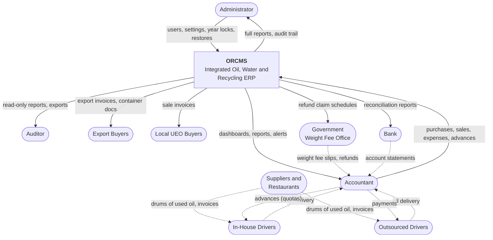

Dotted arrows are physical or paper flows that reach the system through the Accountant — the only data-entry role (SRS §2.1). This is why every inbound flow converges on one actor: it is a design constraint, not an accident, and it is what makes the activity log a complete record of who entered what.

---

## Part 3 — Level 1 data flow

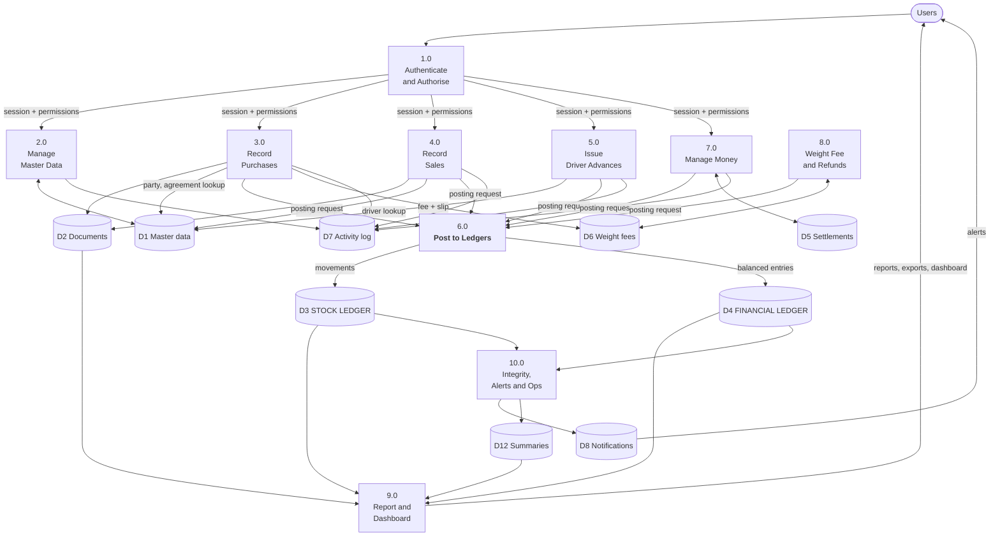

**Read this diagram for one thing:** processes 3.0 through 8.0 never write to D3 or D4 themselves. They all hand a *posting request* to 6.0, and only 6.0 touches the two authoritative stores. That single choke point is what makes the invariants in [§4.11](IMPLEMENTATION.md) enforceable — there is exactly one place where money and stock can change.

---

## Part 4 — Level 2 data flows

### 4.1 Process 6.0 — Post to Ledgers (the engine)

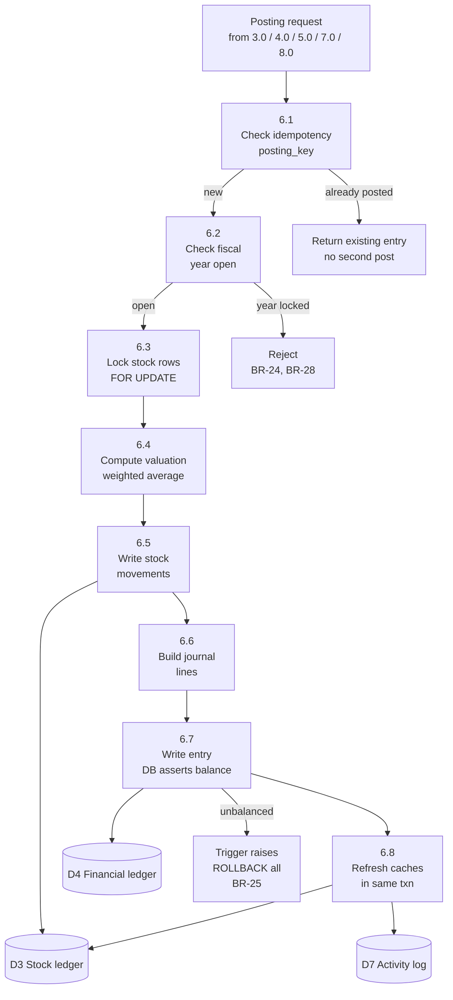

Everything between 6.3 and 6.8 runs inside **one database transaction**. There is no partial state: either the stock moved and the money posted and the caches refreshed, or none of it happened.

### 4.2 Process 5.0 — Issue In-House Driver Advances

This process handles issuing money (quotas) to in-house drivers so they can purchase oil from suppliers.

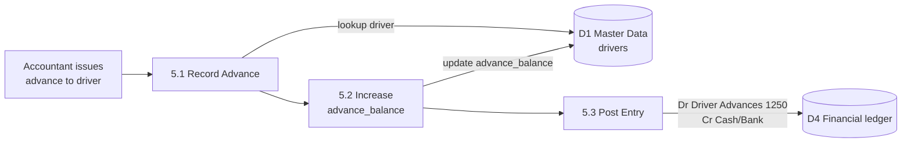

Note what does **not** happen at 5.3: no expense is created. The advance is an asset (receivable) until the driver returns with oil and a purchase is recorded, which deducts from their `advance_balance` and posts to Inventory.

### 4.3 Process 8.0 — Weight fee refund pipeline

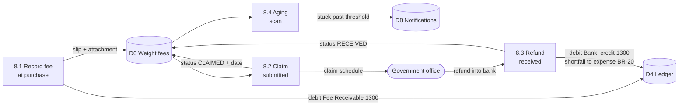

This is effectively an accounts-receivable subledger where the debtor is the government. Treating it as one — rather than as a note on a purchase — is what makes "Total Outstanding Refunds Owed by Government" a real, reconcilable dashboard figure.

---

## Part 5 — Scenario user flows

Sixteen scenarios covering the paths that actually get used. Each states its actor, what gets written, which rules apply, and where it can fail.

---

### S1 — Sign in

**Actor:** any user · **Trigger:** start of the working day

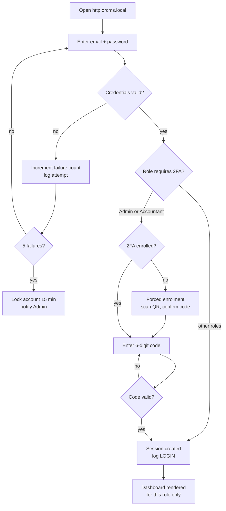

**Writes:** `activity_logs` (LOGIN or failed attempt), session store
**Rules:** 2FA mandatory for Admin and Accountant (§6.1); navigation shows only permitted modules

---

### S2 — Accountant records a UCO purchase from a driver collection

The most frequent transaction in the system. The path branches depending on whether the driver is in-house (deducted from their advance) or outsourced (paid directly).

**Actor:** Accountant · **Trigger:** driver returns with drums and paperwork
**Preconditions:** driver and supplier exist; fiscal year open

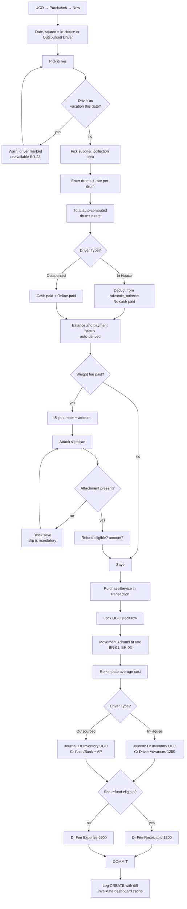

**Writes:** `purchases`, `weight_fees`, `attachments`, `stock_movements`, `stock_balances`, `journal_entries`, `journal_lines`, `activity_logs`, updated driver `advance_balance` if in-house.
**Rules:** BR-01 (drums only), BR-02 (UCO only), BR-03 (stock up), BR-23 (vacation), BR-25 (balanced), BR-26 (idempotent)
**Failure paths:** locked fiscal year → rejected before any write; missing slip attachment → blocked at validation; double-click on Save → second request returns the first entry, does not post twice

---

### S3 — Purchase under a direct company agreement

**Actor:** Accountant · **Difference from S2:** rate comes from the contract, and reporting must keep these separate from driver collections

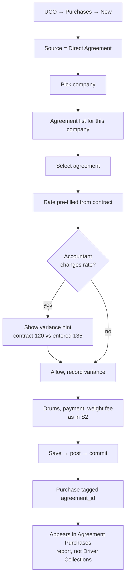

**Writes:** `purchases` with `agreement_id` set, plus everything in S2
**Why the variance is allowed but flagged:** contract rates get renegotiated verbally before the paperwork catches up. Blocking the entry would push the accountant to falsify the rate; flagging it produces a variance report the owner can actually act on.

---

### S4 — Export sale of used cooking oil

**Actor:** Accountant · **Trigger:** container shipped to a foreign buyer

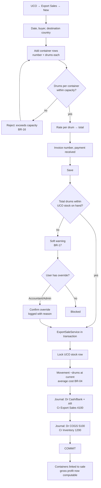

**Writes:** `export_sales`, `containers`, `stock_movements`, two journal entries, `activity_logs`
**Rules:** BR-04, BR-16, BR-17, BR-25
**Note:** the second journal entry is what makes divisional gross profit possible. Recording revenue without simultaneously relieving inventory at cost produces a P&L that overstates profit until someone does a manual stock adjustment — the failure mode this design exists to prevent.

---

### S5 — Local sale of used engine oil

**Actor:** Accountant · **Structurally identical to S4**, with a tanker instead of containers

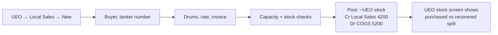

**Rules:** BR-05, BR-16, BR-17
**The split view matters:** UEO stock has two upstream sources — direct purchases and oil recovered from water treatment (BR-09). The operationally interesting question is how much of what was sold came from the treatment plant rather than being bought, so the stock screen keeps the two streams visible.

---

### S6 — Payment received, split across three invoices

**Actor:** Accountant · **Trigger:** buyer pays a lump sum covering several outstanding invoices

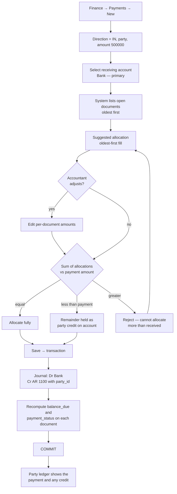

**Writes:** `payments`, `payment_allocations`, `journal_entries`, `journal_lines`, updated `payment_status` on each target document
**Rules:** §4.1 rule 8 (rounding to the last row), BR-25
**Why not force full allocation:** partial and advance payments are normal in this trade. Forcing the remainder onto an arbitrary invoice is how party balances become fiction. Holding it as a visible credit keeps the party ledger honest.

---

### S10 — Government weight fee refund lifecycle

Spans weeks or months and three separate user sessions.

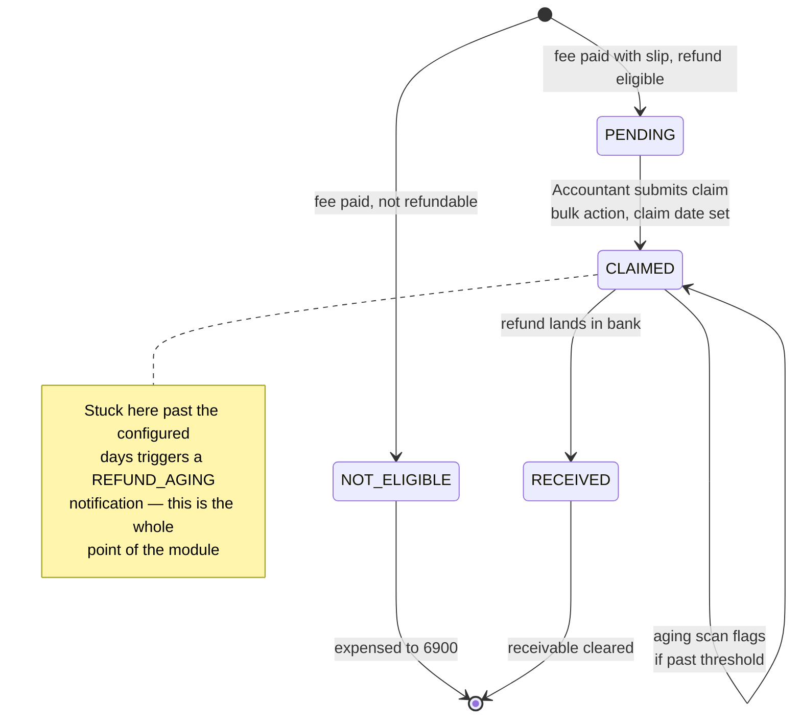

**Session 1 — at purchase (part of S2):** slip recorded, attachment stored, `Dr Fee Receivable 1300`.

**Session 2 — claim submission:**

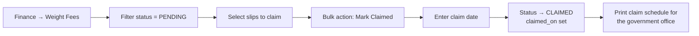

**Session 3 — refund received:**

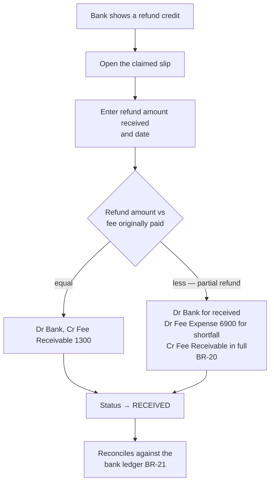

**Rules:** BR-20 (refund may differ from amount paid), BR-21 (reconciles to bank)
**Dashboard effect:** the 1300 balance is "Total Outstanding Refunds Owed by Government" — a figure the owner can chase, because it ties to a list of specific slips.

---

### S11 — Bank reconciliation

**Actor:** Accountant · **Trigger:** monthly bank statement arrives

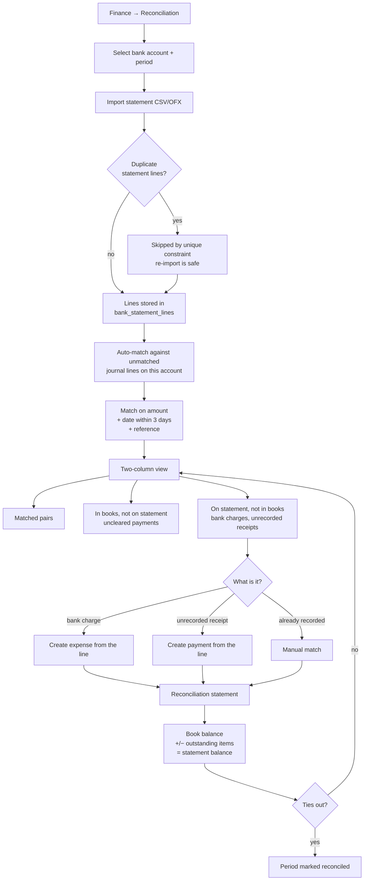

**Writes:** `bank_statement_lines`, `matched_line_id` links, possibly new expenses or payments
**Key property:** matching never edits either side. The books stay the books and the statement stays the statement — otherwise the comparison proves nothing.

---

### S12 — Expenses, salaries, and owner's drawings

Three flows that look similar and post very differently. The distinction is the one most often lost in spreadsheet bookkeeping.

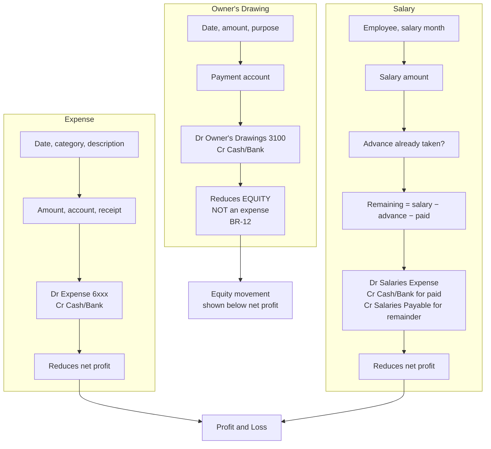

**Rules:** BR-12 (drawings are not expenses), BR-13 (expenses are company-wide, not division-tagged)
**Why this matters commercially:** treating drawings as an expense understates profit, which distorts every margin figure the owner uses to price purchases. The P&L template deliberately places drawings in a separate block *below* net profit so the difference is visible on the page.

---

### S13 — Correcting a mistake

Two distinct correction paths. Choosing the wrong one is how ledgers get corrupted.

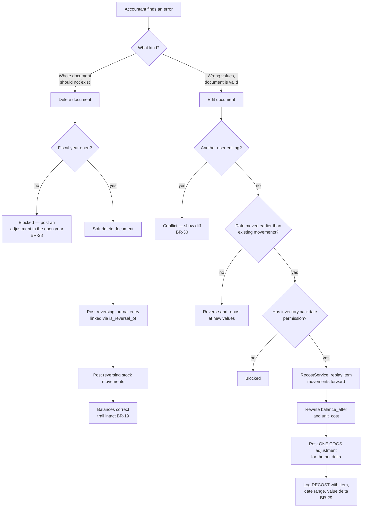

**Rules:** BR-19, BR-28, BR-29, BR-30
**The principle:** historical journal entries are never rewritten. A backdated change produces a *new* adjustment entry, so the auditor can see both what was originally recorded and what corrected it.

---

### S14 — Month-end and year-end close

**Actor:** Accountant (month-end), Administrator (year lock)

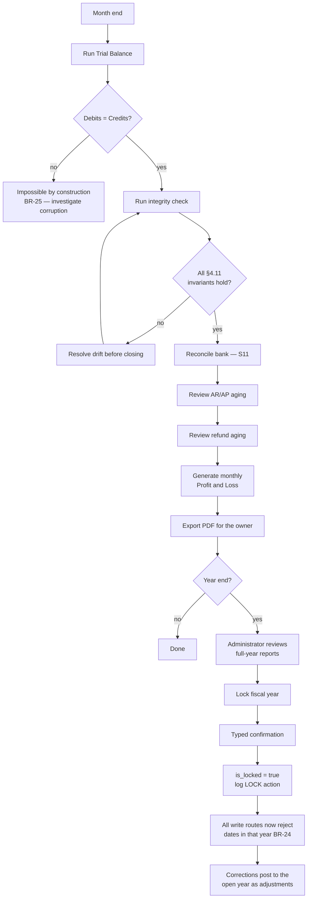

---

### S15 — Auditor reviews a past year

**Actor:** Auditor · **Access:** read-only, all years

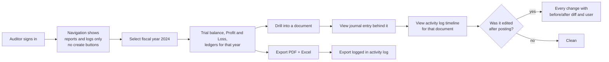

**Rules:** every write route returns 403 (§6.1); historical years fully readable (BR-19)
**What the auditor can prove:** for any figure in any report, the chain document → journal entry → who entered it → every subsequent change. That chain is the deliverable of the audit trail, not the log viewer itself.

---

### S16 — Automated overnight cycle

**Actor:** none — the scheduler

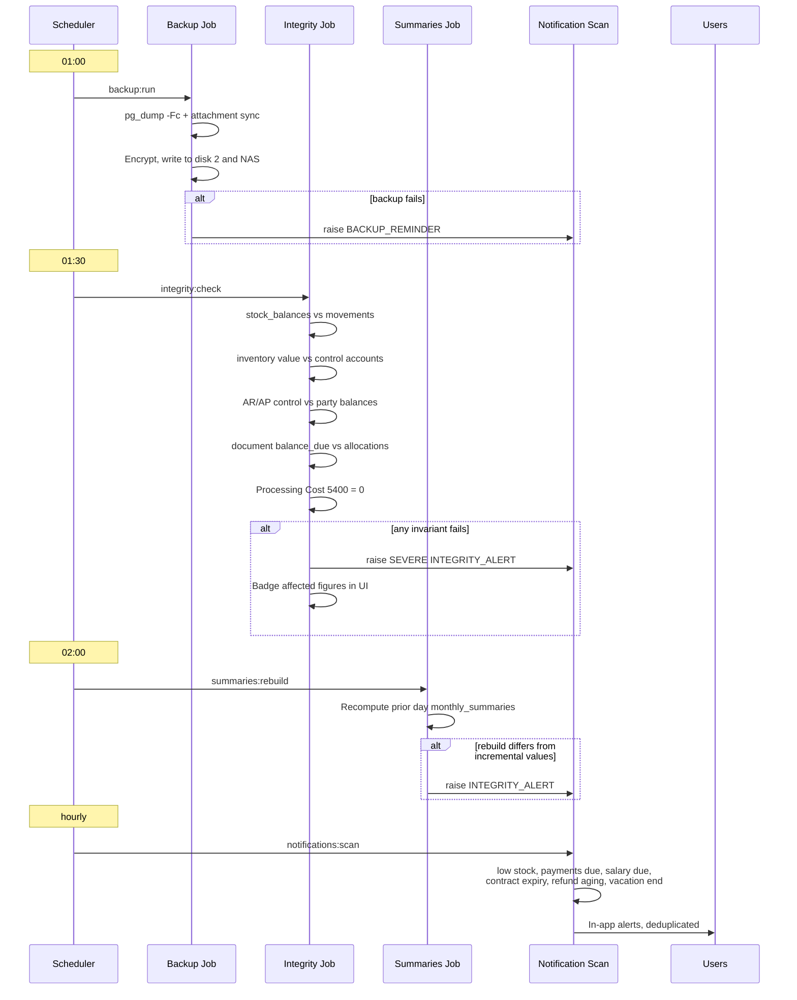

---

## Part 6 — State machines

### Document payment status

```mermaid
stateDiagram-v2
    [*] --> UNPAID: document posted, nothing received
    [*] --> PARTIAL: part paid at entry
    [*] --> PAID: paid in full at entry
    UNPAID --> PARTIAL: allocation applied
    UNPAID --> PAID: full allocation
    PARTIAL --> PAID: balance settled
    PARTIAL --> UNPAID: allocation reversed
    PAID --> PARTIAL: allocation reversed
    PAID --> [*]
    note right of PARTIAL
        Never set by hand.
        Always derived from
        total minus allocations.
    end note
```

### Fiscal year

```mermaid
stateDiagram-v2
    [*] --> OPEN: created
    OPEN --> LOCKED: Administrator locks after review
    LOCKED --> OPEN: Administrator unlocks<br/>logged, exceptional
    LOCKED --> [*]: remains readable forever
    note right of LOCKED
        Rejects every write including
        reversals. Corrections go to
        the open year. BR-24, BR-28
    end note
```

---

## Part 7 — Exception and edge-case flows

| Scenario | Trigger | System response | Rule |
|---|---|---|---|
| Zero-activity day | No purchases collected | "No Purchase" flag records the day with zero values; excluded from totals, present in the daily-completeness report | BR-22 |
| Sale exceeds stock | Drums sold > on hand | Soft warning, Admin/Accountant override, override logged with reason | BR-17 |
| Container overfilled | Assigned drums > capacity | Hard block at validation | BR-16 |
| Double submit | Save clicked twice | Second request returns the first entry; one posting exists | BR-26 |
| Concurrent edit | Two accountants, one document | Second save rejected with a field-level diff | BR-30 |
| Write into locked year | Any dated write | Rejected before any database work | BR-24, BR-28 |
| Manual entry on control account | AR, AP, or Inventory in a manual journal | Rejected at validation | BR-27 |
| Unbalanced entry | Any path, including raw SQL | Database trigger raises at COMMIT, whole transaction rolls back | BR-25 |
| Cache drift | Nightly integrity check fails | SEVERE alert naming the row; figure badged in the UI until resolved | §4.11 |
| Partial refund | Government refunds less than paid | Shortfall booked to expense, receivable cleared in full | BR-20 |
| Backup failure | No successful backup in 24h | BACKUP_REMINDER notification to Administrator | §6.10 |

---

## Part 8 — Scenario to requirement traceability

| Scenario | Requirement source | Rules exercised |
|---|---|---|
| S1 Sign in | Bold §2, SRS §3, §5.3 | 2FA, RBAC |
| S2 Driver-collection purchase | Bold §4, SRS §4.2, §4.3 | BR-01, 02, 03, 23, 25, 26 |
| S3 Agreement purchase | Bold §4, SRS §4.4 | BR-01, 03 |
| S4 Export sale | Bold §4, SRS §4.5, §4.7 | BR-04, 16, 17 |
| S5 Local sale | Bold §5, SRS §4.6 | BR-05, 16, 17 |
| S6 Split payment | SRS §4.12 | §4.1 rule 8 |
| S7 Refund lifecycle | Bold §8, SRS §4.11 | BR-20, 21 |
| S8 Bank reconciliation | SRS §4.14 | §4.9 |
| S9 Expenses, salaries, drawings | Bold §8, SRS §4.9, 4.10, 4.13 | BR-12, 13 |
| S10 Corrections | SRS §4.15, §6.1 | BR-19, 28, 29, 30 |
| S11 Close and lock | SRS §6.1 | BR-24, 25, 28 |
| S12 Auditor review | Bold §11, SRS §4.16 | BR-18, 19 |
| S13 Overnight cycle | Bold §12, SRS §5.1 | §4.11, §6.10 |
